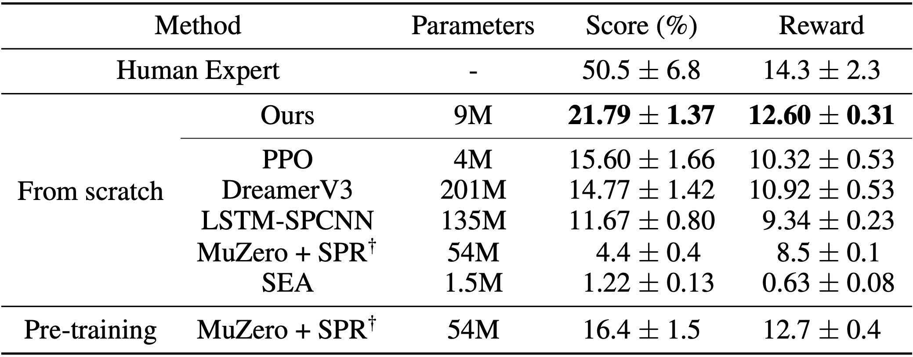

# Achievement Distillation

This is the code for the paper [Discovering Hierarchical Achievements in Reinforcement Learning via Contrastive Learning](https://arxiv.org/abs/2307.03486) accepted to NeurIPS 2023.




## Installation

```
conda create --name ad-crafter python=3.10
conda activate ad-crafter

pip install --upgrade "setuptools==65.7.0" "wheel==0.38.4" "pip==24.0"
pip install -r requirements.txt
pip install -e .
```

## Training

If you are working in a Bash environment, you can use the following commands. The system will set the timestamp to `debug` by default.

PPO
```
python train.py --exp_name ppo --log_stats --save_ckpt
```

PPO + Achievement Distillation (ours)
```
python train.py --exp_name ppo_ad --log_stats --save_ckpt
```

If you are working in an environment that utilizes the Slurm Workload Manager, you can submit your job using `submit.py`. In this setup, the system automatically assigns a timestamp that corresponds to the actual start time of your job.


## Evaluation

If you want to evaluate an agent on a new environment, you can use the following command. This will create a video displaying the agent's behavior.

```
python eval.py --exp_name [your exp name] --timestamp [your timestamp]
```

## Citation

If you find this code useful, please cite this work.

```
@inproceedings{moon2023ad,
    title={Discovering Hierarchical Achievements in Reinforcement Learning via Contrastive Learning},
    author={Seungyong Moon and Junyoung Yeom and Bumsoo Park and Hyun Oh Song},
    booktitle={Neural Information Processing Systems},
    year={2023}
}
```

## Credit
- https://github.com/openai/Video-Pre-Training
- https://github.com/snu-mllab/DCPG
